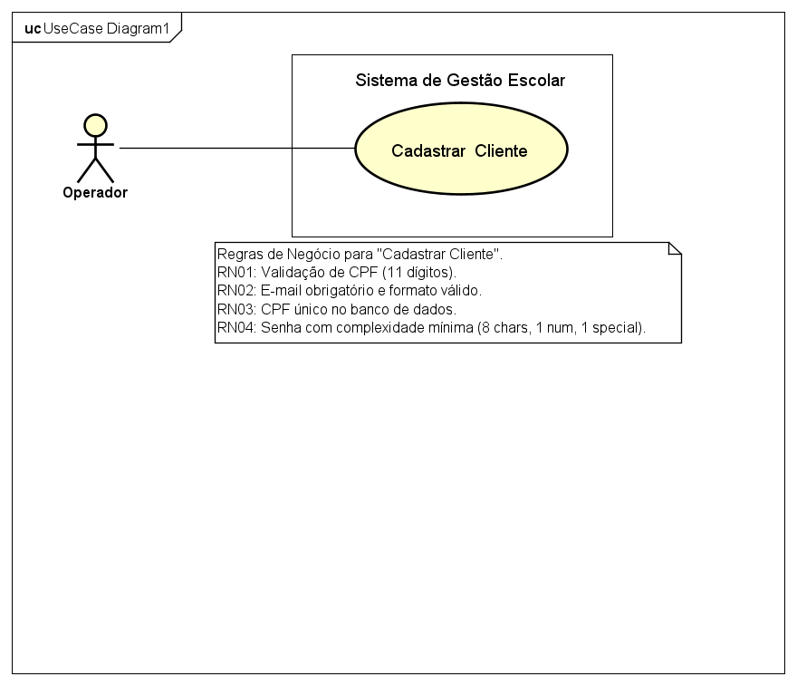

# 📘 Projeto UML – Astah

Este repositório contém a modelagem UML desenvolvida no software **Astah UML** como parte dos meus estudos no curso de **Sistemas de Informação**.  
O objetivo é documentar visualmente funcionalidades de um sistema, utilizando boas práticas de modelagem e organização.

---

## 🎯 Objetivo do Projeto
Criar um conjunto de diagramas UML que representem:
- Funcionalidades principais do sistema  
- Interações entre usuário e sistema  
- Estrutura lógica (classes)  
- Fluxos de execução (sequência)  

Este repositório servirá como base para estudos, portfólio e evolução acadêmica.

---

## 📂 Estrutura do Repositório

---

## 🛠 Ferramentas Utilizadas
- **Astah UML** – Criação dos diagramas  
- **Git & GitHub** – Versionamento e armazenamento  
- **Windows 11** – Ambiente de desenvolvimento  

---

## 📘 Diagramas Criados

### ✔ Caso de Uso: Cadastrar Cliente
Representa a interação entre o **Usuário** e o sistema para registrar novos clientes.

**Atores envolvidos:**
- Usuário

**Descrição:**
O usuário acessa o sistema e realiza o cadastro de um novo cliente, preenchendo informações essenciais.

---

## 🚀 Próximos Passos

### 🔹 Modelagem
- Adicionar novos casos de uso  
- Criar o **Diagrama de Classes** baseado nos casos de uso  
- Criar **Diagramas de Sequência**  
- Criar **Diagrama de Atividades**  
- Exportar diagramas para PNG/PDF  

### 🔹 Organização
- Criar pasta `/diagramas` para armazenar imagens  
- Criar documentação complementar (ex.: requisitos, fluxos, regras de negócio)

---

## 📚 Aprendizados Envolvidos
- Modelagem UML  
- Análise de requisitos  
- Representação visual de sistemas  
- Boas práticas de documentação  
- Versionamento com Git e GitHub  

---

## 👨‍💻 Autor

**Fabiano Faria de Resende**  
Estudante de **Sistemas de Informação**  
São Gonçalo – RJ, Brasil  

---

## 📎 Licença
Este projeto é de uso educacional e livre para consulta.

---

## 📊 Diagramas do Projeto

### Caso de Uso - Cliente

